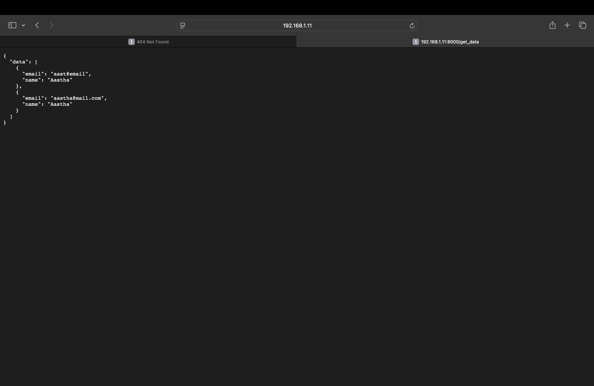

# Flask Web Framework Guide

Flask is a lightweight web server framework written in Python.

## What is a Web Framework?
A web framework is a collection of tools and libraries in a particular programming language that simplifies the creation of web applications and web servers. It provides pre-built components for handling common web development tasks like routing, request handling, and response generation.

### What is a Web Server?
A web server is a software application that serves content over the internet or a network. It accepts HTTP requests from clients (like web browsers) and responds with web pages, data, or other resources. Web frameworks help you build these servers more efficiently.

#### Popular Python Web Frameworks:
- **Django** - Full-featured framework with batteries included
- **Flask** - Lightweight and flexible microframework
- **FastAPI** - Modern, fast framework for building APIs
- **web2py** - Full-stack framework with emphasis on ease of use
- **Bottle** - Minimalist framework for small applications
- **CherryPy** - Object-oriented web framework

## What is a REST API?
A REST (Representational State Transfer) API is a standardized architectural style for building web services. It uses HTTP methods and follows specific principles for creating scalable and maintainable APIs.

### What is an API?
API stands for Application Programming Interface. It's a set of rules and protocols that allows different software applications to communicate with each other. A RESTful API is one that conforms to REST architectural constraints.

### Understanding URLs
```python
http://localhost:5000/home/data?time=10
```

Breaking down the components:
- **http/https** - Protocol (communication standard)
- **localhost** - Hostname (server address)
- **5000** - Port number (optional, defaults to 80 for HTTP, 443 for HTTPS)
- **/home/data** - Route/Path (endpoint on the server)
- **?time=10** - Query parameters (data passed to the server)

### What is JSON?
JSON (JavaScript Object Notation) is a lightweight data interchange format that's easy for humans to read and write, and easy for machines to parse and generate. It's the most common format for sending and receiving data in REST APIs.

Example:
```json
{
  "name": "John",
  "age": 30,
  "city": "New York"
}
```

### Common HTTP Request Methods
- **GET** - Retrieve data from the server
- **POST** - Send data to create a new resource
- **PUT** - Update an existing resource
- **PATCH** - Partially update an existing resource
- **DELETE** - Remove a resource

## Getting Started with Flask

### Installation
```bash
pip install Flask
```

### Basic Flask Application
```python
from flask import Flask

app = Flask(__name__)

@app.route('/')
def home():
    return 'Hello, World!'

if __name__ == '__main__':
    app.run(debug=True)
```

### Key Concepts:
- `Flask(__name__)` - Creates a Flask application instance
- `@app.route('/')` - Decorator that defines a route (URL endpoint)
- `app.run(debug=True)` - Starts the development server with debug mode enabled

### Running Your Flask App
1. Save your code in a file (e.g., `app.py`)
2. Run it with: `python app.py`
3. Access it in your browser at: `http://localhost:5000`


## Flask vs FastAPI

While Flask is an excellent choice for web applications, **FastAPI** is a modern alternative that's becoming increasingly popular, especially for building APIs. Here's a quick comparison:

### Flask
- **Mature & Stable** - Released in 2010, battle-tested
- **Flexible** - Unopinionated, allows any structure
- **Great for Web Apps** - Excellent template support with Jinja2
- **Manual Validation** - Requires additional libraries for data validation
- **Synchronous** - Primarily synchronous (async support added recently)

### FastAPI
- **Modern & Fast** - Released in 2018, built for performance
- **API-First** - Designed specifically for building APIs
- **Auto Documentation** - Automatic interactive API docs (Swagger UI)
- **Built-in Validation** - Automatic data validation with Pydantic
- **Async Native** - Native async/await support for high performance

### When to Choose Each

**Choose Flask if:**
- Building traditional web applications with HTML pages
- You want maximum flexibility and control
- You prefer a gentle learning curve
- Working on smaller projects or prototypes

**Choose FastAPI if:**
- Building REST APIs or microservices
- Performance is critical
- You want automatic API documentation
- You need built-in data validation
- Working with asynchronous operations

### Want to Learn FastAPI?

For a comprehensive guide on FastAPI with examples and documentation, check out:

**[FastAPI Documentation & Examples →](https://github.com/aastha231074/Python/tree/main/fast_api)**

---

## Additional Resources
- **Flask Official Documentation**: https://flask.palletsprojects.com/
- **FastAPI Official Documentation**: https://fastapi.tiangolo.com/
- **REST API Best Practices**: https://restfulapi.net/

## Screeshots of the running application 

<figure>
  
  <figcaption>Sign-in page where users enter their credentials</figcaption>
</figure>

<figure>
  
  <figcaption>Form submission page</figcaption>
</figure>

<figure>
  
  <figcaption>Data retrieval interface</figcaption>
</figure>

<figure>
  
  <figcaption>View page displaying the results</figcaption>
</figure>