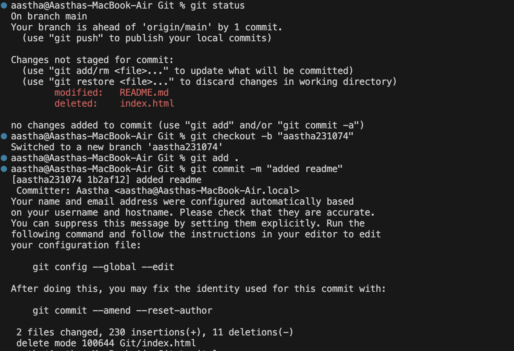
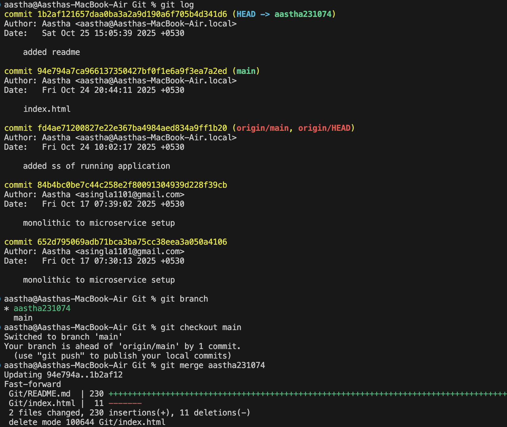
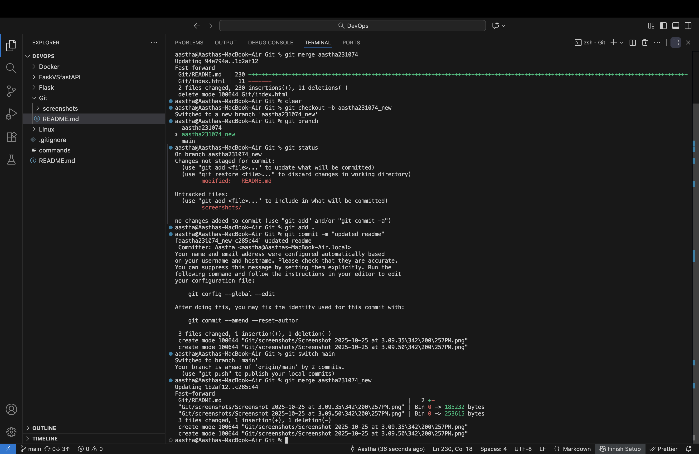

# Version Control, Git, and GitHub - README

## What is Version Control?

Version control is a system that tracks changes to files over time. It allows you to:
- Record changes to your code
- Revert to previous versions if something breaks
- Collaborate with others without overwriting each other's work
- Understand who made what changes and why

Think of it like "track changes" in Microsoft Word, but much more powerful and designed for code.

## What is Git?

Git is a distributed version control system created by Linus Torvalds in 2005. It's the most popular version control system in the world. "Distributed" means every developer has a complete copy of the project history on their local machine, not just the latest version.

### Key Git Concepts

- **Repository (repo)**: A project folder tracked by Git
- **Commit**: A snapshot of your project at a specific point in time
- **Branch**: A parallel version of your code where you can work independently
- **Merge**: Combining changes from different branches
- **Remote**: A version of your repository hosted on the internet or network

## What is GitHub?

GitHub is a cloud-based hosting service for Git repositories. It adds:
- A web interface for managing repositories
- Collaboration features (pull requests, code reviews, issues)
- Project management tools
- Social networking features for developers

**Note**: Git and GitHub are different things. Git works locally on your computer; GitHub is an online service. There are alternatives to GitHub like GitLab and Bitbucket.

## Essential Git Commands

### Setup & Configuration

```bash
# Set your name (appears in commits)
git config --global user.name "Your Name"

# Set your email
git config --global user.email "your.email@example.com"

# Check your settings
git config --list
```

### Setting Up SSH Keys for GitHub

SSH keys provide a secure way to authenticate with GitHub without typing your password every time. This is the recommended method for connecting to GitHub.

#### Generating SSH Keys

```bash
# Generate a new SSH key (replace with your GitHub email)
ssh-keygen -t ed25519 -C "your.email@example.com"

# For older systems that don't support ed25519
ssh-keygen -t rsa -b 4096 -C "your.email@example.com"

# When prompted:
# - Press Enter to accept default file location (~/.ssh/id_ed25519)
# - Enter a secure passphrase (optional but recommended)
```

#### Adding SSH Key to SSH Agent

```bash
# Start the ssh-agent in the background
eval "$(ssh-agent -s)"

# Add your SSH private key to the ssh-agent
ssh-add ~/.ssh/id_ed25519

# For RSA keys
ssh-add ~/.ssh/id_rsa
```

#### Adding SSH Key to GitHub

```bash
# Copy SSH public key to clipboard (macOS)
pbcopy < ~/.ssh/id_ed25519.pub

# Copy SSH public key to clipboard (Linux with xclip)
xclip -selection clipboard < ~/.ssh/id_ed25519.pub

# Copy SSH public key to clipboard (Windows Git Bash)
cat ~/.ssh/id_ed25519.pub | clip

# Or simply display the key to copy manually
cat ~/.ssh/id_ed25519.pub
```

**Then on GitHub:**
1. Go to Settings → SSH and GPG keys
2. Click "New SSH key"
3. Give it a descriptive title (e.g., "My Laptop")
4. Paste your public key
5. Click "Add SSH key"

#### Testing SSH Connection

```bash
# Test your SSH connection to GitHub
ssh -T git@github.com

# You should see a message like:
# Hi username! You've successfully authenticated, but GitHub does not provide shell access.
```

#### Using SSH URLs with Git

```bash
# Clone using SSH (instead of HTTPS)
git clone git@github.com:username/repository.git

# Change existing repository from HTTPS to SSH
git remote set-url origin git@github.com:username/repository.git

# Verify the change
git remote -v
```

### Starting a Repository

```bash
# Initialize a new Git repository in current folder
git init

# Clone an existing repository from GitHub
git clone <repository-url>
```

### Basic Workflow Commands

```bash
# Check status of your files (modified, staged, etc.)
git status

# Add specific file to staging area
git add <filename>

# Add all changed files to staging area
git add .

# Commit staged changes with a message
git commit -m "Your commit message here"

# Add and commit in one command (for tracked files only)
git commit -am "Your commit message"
```

### Viewing History

```bash
# View commit history
git log

# View compact commit history
git log --oneline

# View changes in files
git diff
```

### Working with Branches

```bash
# List all branches
git branch

# Create a new branch
git branch <branch-name>

# Switch to a branch
git checkout <branch-name>

# Create and switch to new branch in one command
git checkout -b <branch-name>

# Merge another branch into current branch
git merge <branch-name>

# Delete a branch
git branch -d <branch-name>
```

### Working with Remote Repositories (GitHub)

```bash
# Add a remote repository
git remote add origin <repository-url>

# View remote repositories
git remote -v

# Push commits to remote repository
git push origin <branch-name>

# Push and set upstream branch (first time)
git push -u origin <branch-name>

# Pull latest changes from remote
git pull origin <branch-name>

# Fetch changes without merging
git fetch origin
```

### Undoing Changes

```bash
# Discard changes in working directory
git checkout -- <filename>

# Unstage a file (keep changes)
git reset <filename>

# Undo last commit (keep changes)
git reset --soft HEAD~1

# Undo last commit (discard changes) - USE CAREFULLY
git reset --hard HEAD~1

# Revert a commit by creating a new commit
git revert <commit-hash>
```

### Stashing Changes

Stashing allows you to temporarily save changes without committing them. This is useful when you need to switch branches but aren't ready to commit your current work.

```bash
# Stash current changes (tracked files only)
git stash

# Stash with a descriptive message
git stash save "work in progress on login feature"

# Stash including untracked files
git stash -u

# Stash including untracked and ignored files
git stash -a

# List all stashes
git stash list

# Show contents of most recent stash
git stash show

# Show detailed diff of most recent stash
git stash show -p

# Apply most recent stash (keeps stash in list)
git stash apply

# Apply specific stash
git stash apply stash@{2}

# Apply most recent stash and remove it from stash list
git stash pop

# Apply specific stash and remove it
git stash pop stash@{1}

# Delete most recent stash
git stash drop

# Delete specific stash
git stash drop stash@{0}

# Delete all stashes
git stash clear

# Create a branch from a stash
git stash branch <branch-name>
```

**Common Stash Workflow:**
```bash
# You're working on feature-x branch
git status  # Shows modified files

# Suddenly need to switch to main for urgent fix
git stash save "feature-x: half-done implementation"

# Switch to main and fix bug
git checkout main
# ... make fixes ...
git commit -m "Fix critical bug"

# Go back to feature-x and restore your work
git checkout feature-x
git stash pop
# Continue working...
```

## Basic Git Workflow Example

```bash
# 1. Clone a repository
git clone https://github.com/username/project.git
cd project

# 2. Create a new branch for your feature
git checkout -b feature-new-button

# 3. Make changes to your files
# ... edit files ...

# 4. Stage and commit changes
git add .
git commit -m "Add new button to homepage"

# 5. Push to GitHub
git push -u origin feature-new-button

# 6. Create a Pull Request on GitHub (via web interface)

# 7. After PR is approved, switch to main and pull updates
git checkout main
git pull origin main
```

## Common GitHub Workflow

1. **Fork** a repository to your account (optional, for external projects)
2. **Clone** the repository to your local machine
3. Create a **branch** for your changes
4. Make changes and **commit** them
5. **Push** your branch to GitHub
6. Open a **Pull Request** to propose your changes
7. Discuss and **review** code with collaborators
8. **Merge** the pull request once approved

## Best Practices

- **Commit often** with clear, descriptive messages
- **Use branches** for new features or experiments
- **Pull before you push** to avoid conflicts
- **Write meaningful commit messages**: "Fix login bug" not "fixed stuff"
- **Don't commit sensitive data** (passwords, API keys)
- Use a **.gitignore** file to exclude files you don't want tracked
- **Use SSH keys** for secure authentication with GitHub
- **Stash changes** instead of committing incomplete work when switching branches
- Review changes with `git diff` before committing
- Keep commits atomic (one logical change per commit)

## Getting Help

```bash
# Get help for any command
git help <command>
git <command> --help

# Example
git help commit
```

## Additional Resources

- [Official Git Documentation](https://git-scm.com/doc)
- [GitHub Guides](https://guides.github.com/)
- [Interactive Git Tutorial](https://learngitbranching.js.org/)
- [Git Cheat Sheet](https://education.github.com/git-cheat-sheet-education.pdf)

## Next Steps

- Practice with a personal project
- Explore GitHub's features (Issues, Actions, Projects)
- Learn about .gitignore files
- Study branching strategies (Git Flow, GitHub Flow)
- Learn about rebasing and cherry-picking for advanced workflows

---

**Happy Coding! 🚀**





   